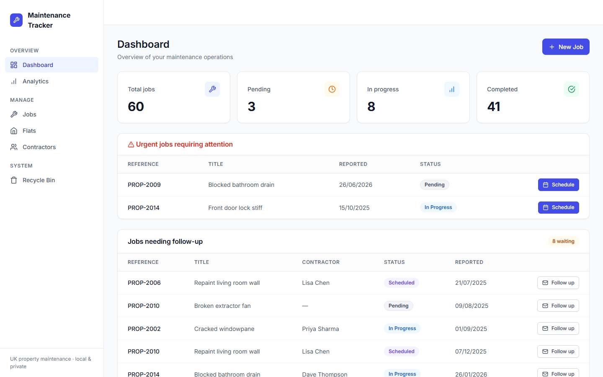
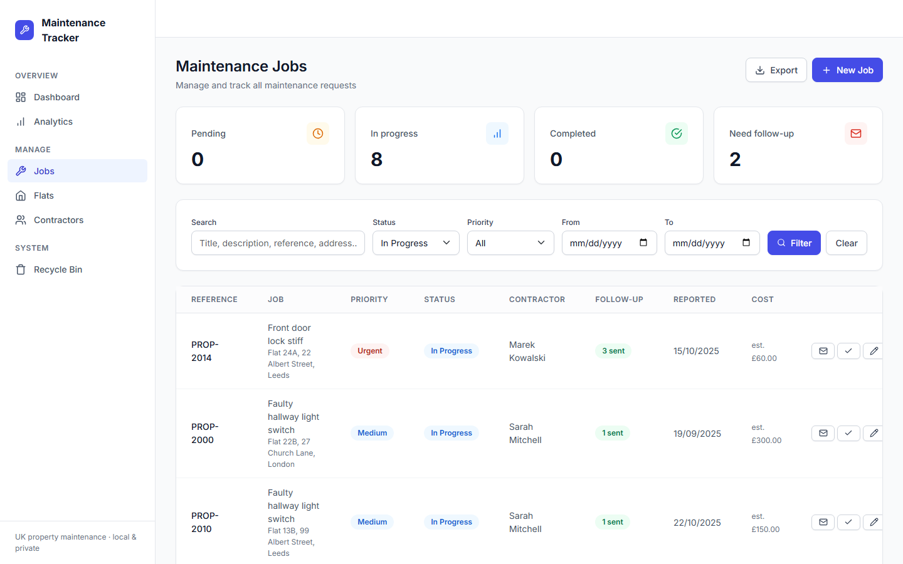
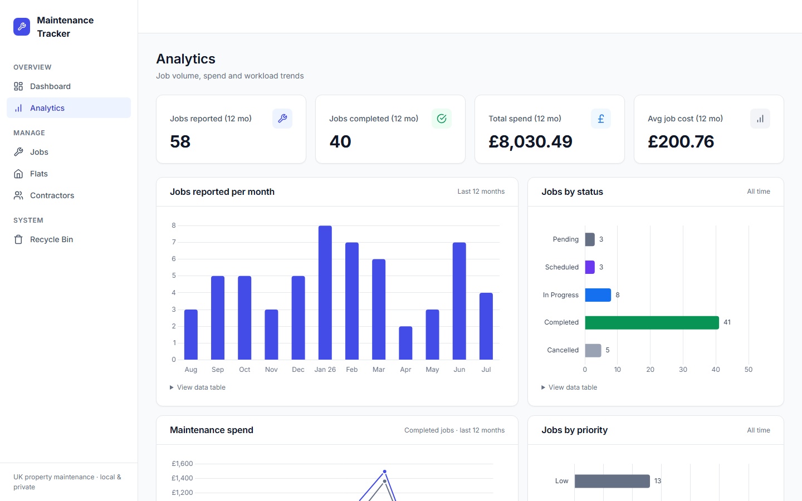
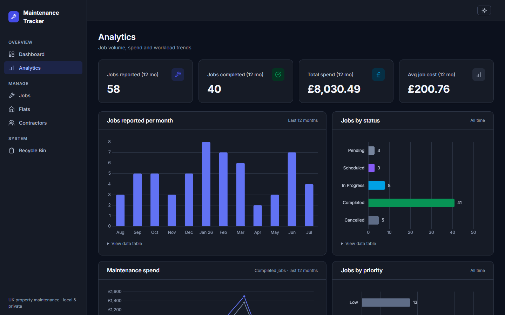
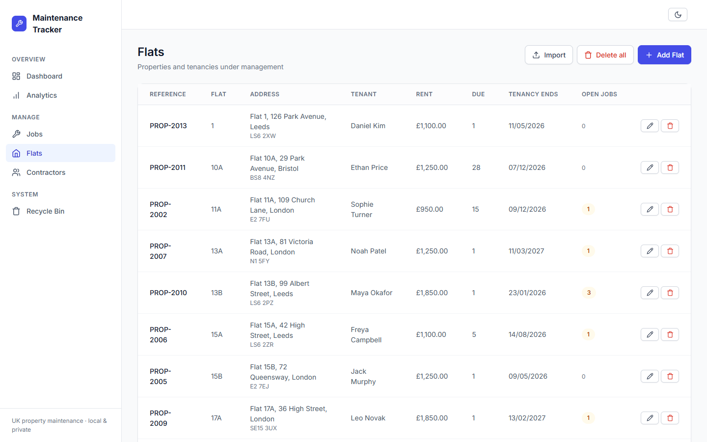

# Maintenance Tracker

[](https://github.com/chusonn/maintenance_tracker/actions/workflows/ci.yml)


A Flask web app for managing UK rental-property maintenance: flats and tenancies, contractors, and maintenance jobs with scheduling, follow-up tracking, cost comparison, Excel import/export, an analytics dashboard, and a soft-delete recycle bin. Sign-in protected and small-team ready: it runs locally or on a small server (SQLite storage, daily automatic backups), built for property managers handling a real portfolio of 200+ flats.



🎬 **[Watch the 50-second demo](docs/demo.mp4)** — a captioned walkthrough: composing a follow-up from a template, sending it, then bulk-sending the whole due queue (recorded against a local test mailbox with demo data).

## Features

- **Job lifecycle** — `Pending → Scheduled → In Progress → Completed` (or `Cancelled`), with four priority levels, contractor assignment, estimated-vs-actual cost tracking, and per-job follow-up counts so nothing slips.
- **Follow-up emails** — compose real emails to contractors from editable templates with per-job placeholders (`{contractor_name}`, `{flat_address}`, …), review before sending, and a due-follow-ups queue with one-click bulk send for jobs that have gone quiet. Sending is optional (Gmail SMTP via App Password in `.env`); without it, follow-ups are still recorded.
- **Analytics** — monthly job volume, estimated-vs-actual spend on completed jobs, status/priority breakdowns, and top contractors by completed work. Chart.js reading the app's design tokens; every chart has a data-table twin for accessibility.
- **Flats & tenancies** — properties keyed by a unique payment reference, with tenant details, rent, due dates, and open-job counts at a glance.
- **Excel round-trip** — bulk-import flats from spreadsheets (upserts by payment reference, tolerant of messy real-world data) and export the jobs register to `.xlsx`.
- **Soft-delete recycle bin** — deleting any flat, contractor, or job moves it to a bin; restore or permanently purge from there. Deleting a flat cascades to its jobs and restores them together.
- **Sign-in & accounts** — every page requires an account; no public sign-up. People are added from the Settings page (or `flask create-user`), can be disabled without losing their history, and are locked out for 15 minutes after 5 wrong passwords. Jobs, deletions and emailed follow-ups record who did them.
- **Safety rails** — CSRF protection on every form, confirmation on every destructive action, automatic daily backups (SQLite online-backup API, safe while the app runs) plus a one-click download, `flask backup` / `restore` CLI, idempotent startup schema migrations.
- **Light & dark themes** — one-click toggle that follows the OS preference by default. The dark chart palette is selected and colour-vision-validated against the dark surface, not auto-inverted.
- **UK conventions** — currency in GBP, dates displayed as `dd/mm/yyyy` throughout.

| Jobs | Analytics |
| --- | --- |
|  |  |

<details>
<summary>More screenshots</summary>





</details>

## Quickstart

Requires Python 3.12+.

```bash
python -m venv venv && venv/bin/pip install -r requirements.txt   # Windows: venv\Scripts\pip
venv/bin/flask --app run.py seed                                  # optional: deterministic demo data
venv/bin/flask --app run.py create-user you@example.com           # your sign-in (prompts for name + password)
venv/bin/python run.py                                            # → http://127.0.0.1:5000
```

The SQLite database is created automatically in `instance/` on first run. Configuration is via environment variables (or a `.env` file): `SECRET_KEY`, `DATABASE_URL`, `FLASK_DEBUG`, `HOST`, `PORT`, plus the account, production and backup settings documented in `.env.example`.

To enable follow-up email sending, set `SMTP_USERNAME` and `SMTP_PASSWORD` in `.env` (for Gmail: a per-app [App Password](https://myaccount.google.com/apppasswords), which requires 2-Step Verification). Everything else works without it — see `.env.example`.

## Deploying (Railway)

The repo includes `railway.json` (gunicorn, one worker, `/healthz` health check). SQLite needs a disk that survives deploys, so:

1. **New project → Deploy from GitHub repo**, and pick this repository.
2. **Add a Volume** to the service, mounted at `/data`.
3. **Variables:**
   - `APP_ENV=production`: HTTPS-only cookies and proxy trust. The app refuses to start with a weak key or a non-volume database path.
   - `SECRET_KEY`: 64 random hex characters.
   - `DATABASE_URL=sqlite:////data/maintenance_tracker.db`: four slashes, an absolute path on the volume.
   - `INITIAL_USER_EMAIL`, `INITIAL_USER_NAME`, `INITIAL_USER_PASSWORD`: the first account. It's created only while no accounts exist; remove these after the first sign-in.
4. **Settings → Networking → Generate Domain.**

Daily backups land in `/data/backups` (the same volume). Use **Settings → Download backup** to keep an off-site copy. Keep the service at one instance: SQLite is a single file.

## Development

```bash
venv/bin/pip install -r requirements-dev.txt
venv/bin/python -m pytest        # test suite (in-memory SQLite, fast)
venv/bin/ruff check .            # lint
```

CI runs lint + tests on Python 3.12 and 3.14 on every push and pull request.

## Architecture

App factory + blueprints, SQLAlchemy 2.0 style (`Mapped` models, `select()` queries):

```
run.py                     # entry point
app/
├── __init__.py            # create_app(): login guard, blueprints, filters, prod checks
├── models.py              # User, Flat, Contractor, MaintenanceJob + SoftDeleteMixin
├── config.py              # Config / TestConfig
├── db_migrate.py          # idempotent startup schema sync (additive only)
├── cli.py                 # flask backup / list-backups / restore / create-user / set-password
├── seed.py                # flask seed — deterministic UK demo data
├── blueprints/            # auth, dashboard, analytics, jobs, flats, contractors,
│                          #   message_templates, recycle, settings
├── services/
│   ├── accounts.py        # account rules, sign-in with lockout, first-account bootstrap
│   ├── backup.py          # SQLite online-backup API: daily auto-backup, download, restore
│   ├── excel_io.py        # Excel import/export (pandas lazy-imported)
│   ├── analytics.py       # pure aggregation functions for the analytics page
│   ├── emailer.py         # SMTP transport (stdlib smtplib, STARTTLS)
│   └── followup.py        # placeholder rendering, due-followups query, defaults
├── templates/             # Jinja2; _components.html + _icons.html macro library
└── static/
    ├── css/app.css        # design tokens (--mt-*) + component classes
    └── js/                # app.js, analytics.js (Chart.js, token-driven colors)
tests/                     # pytest suite: auth, routes, backups, Excel IO, analytics, seed
```

Design decisions worth noting:

- **Soft delete everywhere.** All three models share a `SoftDeleteMixin`; list/count/export queries go through `Model.active_select()` so binned rows never leak into views, exports, or charts.
- **Business identity over surrogate display.** Several flats share a flat number across buildings, so the unique `payment_reference` is the identifier users see and Excel import upserts by.
- **Token-based design system.** All styling flows from CSS custom properties in `app.css`; the charts read the same tokens at runtime, so status colors in a chart always match the status badges.
- **Locked by default.** One `before_request` guard protects every route except an explicit public allow-list (`/login`, `/healthz`, static files); a test walks the whole URL map to prove no page slipped through.
- **Boring, reliable migrations.** Startup schema sync only ever adds columns and backfills — no destructive migrations against a live personal database.

## License

Copyright © 2026 Ralph Chu. All rights reserved.

This code is published for portfolio viewing only — no permission is granted to use, copy, or redistribute it. See [LICENSE](LICENSE) for details.
